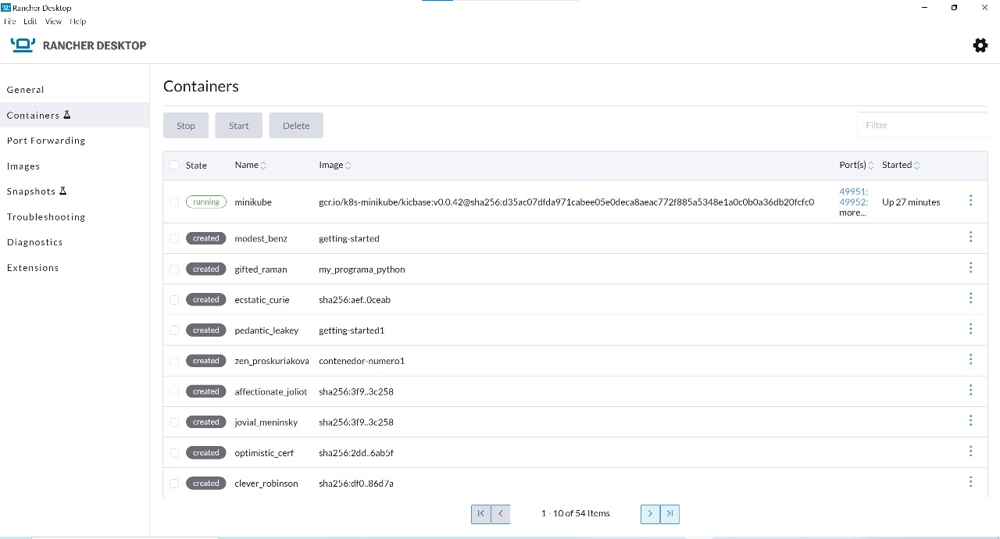
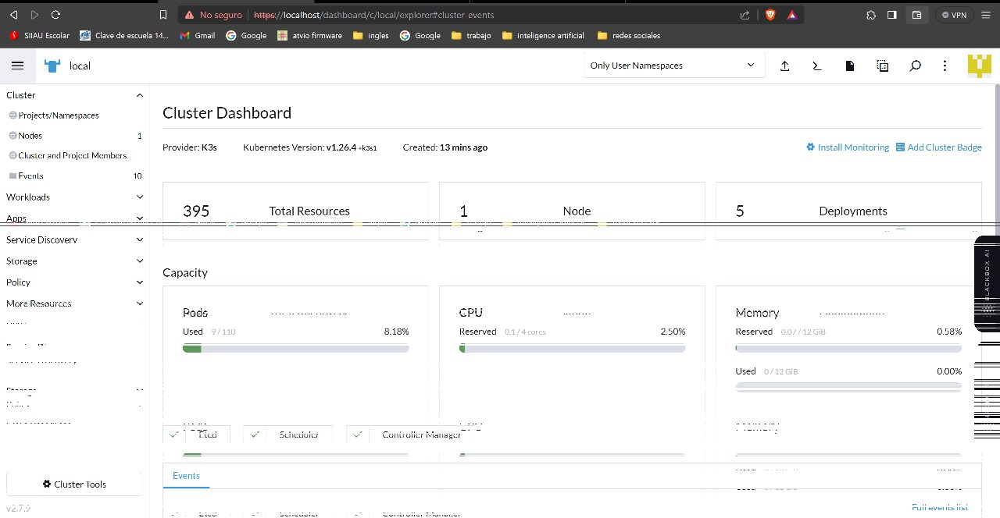
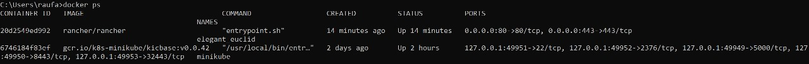
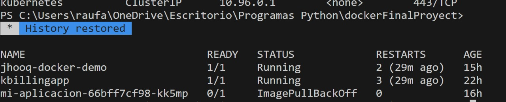
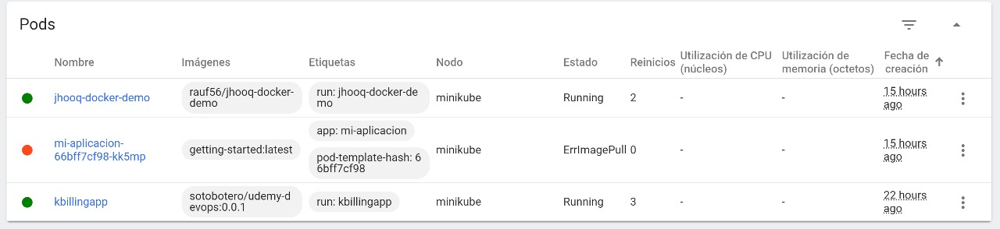
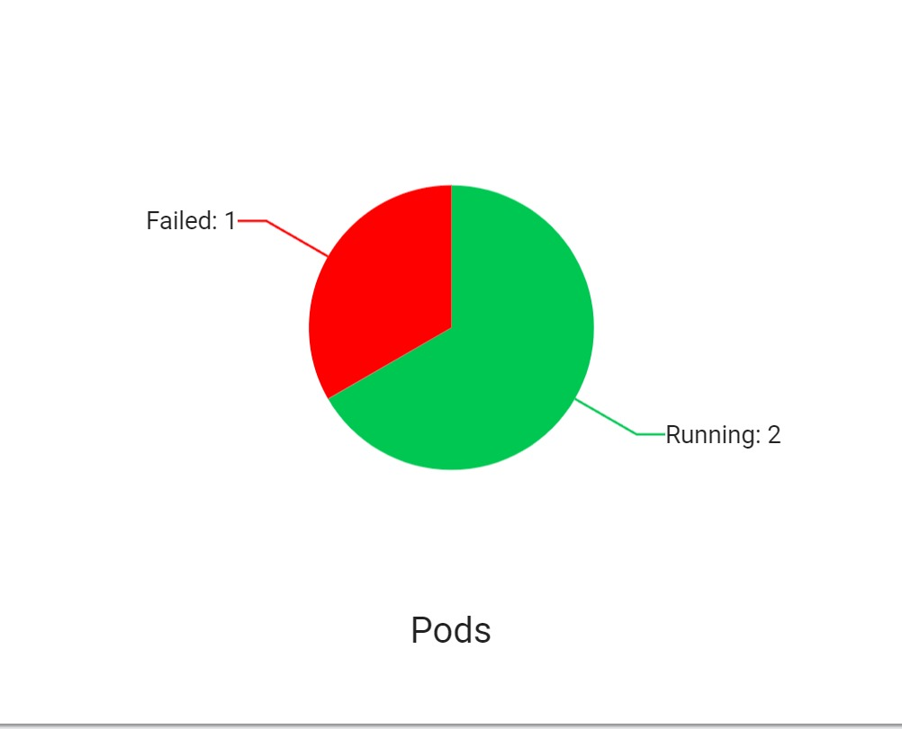
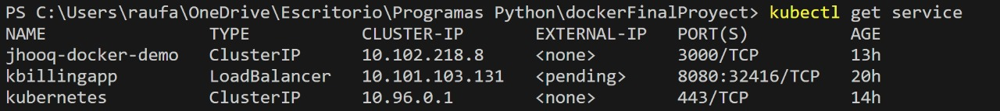
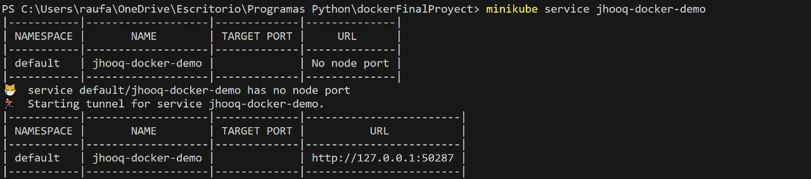
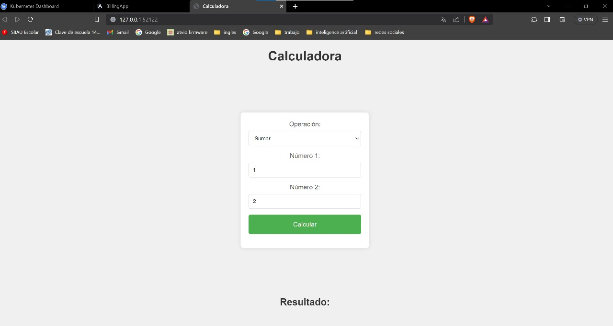

# Proyecto_Tolerancia_a_Fallas
## Miembros del equipo de desarrollo:
* Rauf Alfonso  Hamden Estrada:  221350567
* Ruben Alejandro Gutiérrez Galán: 214798315
  
## Calculador web que permite usar operaciones basicas y conversion de valor a hexadecimal.

### Requisitos:
* Rancher Desktop
* Minikube v1.32.0
* Docker:
    * Client:
     * Cloud integration: v1.0.35+desktop.5
     * Version:           24.0.6
     * API version:       1.43
     * Go version:        go1.20.7
     * Git commit:        ed223bc
     * Built:             Mon Sep  4 12:32:48 2023
     * OS/Arch:           windows/amd64
     * Context:           default
    
    * Server: Docker Desktop 4.25.2 (129061)
     * Engine:
      * Version:          24.0.6
      * API version:      1.43 (minimum version 1.12)
      * Go version:       go1.20.7
      * Git commit:       1a79695
      * Built:            Mon Sep  4 12:32:16 2023
      * OS/Arch:          linux/amd64
      * Experimental:     false
     * containerd:
      * Version:          1.6.22
      * GitCommit:        8165feabfdfe38c65b599c4993d227328c231fca
     * runc:
      * Version:          1.1.8
      * GitCommit:        v1.1.8-0-g82f18fe
     * docker-init:
       * Version:          0.19.0
      * GitCommit:        de40ad0

### Comandos:
  * **para la creacion y ejecucion:**
     * **Creacion del pod**
       ```
       kubectl run jhooq-docker-demo --image=rauf56/jhooq-docker-demo --port=8080
       ```
     * **Exponer el puerto:**
       ```
       kubectl expose pod jhooq-docker-demo --type=LoadBalancer --port=8080 --target-port=80
       ```
      
    * **Ejecutar el servicio:**
      ```
      minikube service jhooq-docker-demo
      ```
  * **Para consultar los pods y service:**
   
    *
       ```
       kubectl get pods //visualizar los pods y su estado
       ```
    *
       ```
       kubectl get services //visualizar los servicios dsiponibles
       ```
    * 
       ```
       kubectl describe services jhooq-docker-demo //muestra la descripcion del servicio
       ```
    * 
       ```
       kubectl describe pod jhooq-docker-demo //describe el pod
       ```
### Ejecucion:
* **Contenedor minikube en Rancher:**
   * 
* **Cluster en Rancher:**
   * 
   * 
* **Verificar que el pod ha sido creado correctamente y esta corriendo:**
   * En consola:
     
   * En forma grafica:
     
     
* **Verificar que el servicio se creo correctamente:**
   * 
* **Ejecutar el servicio:**
   * 
* **Ejecucion exitosa de la pagina web**
   

